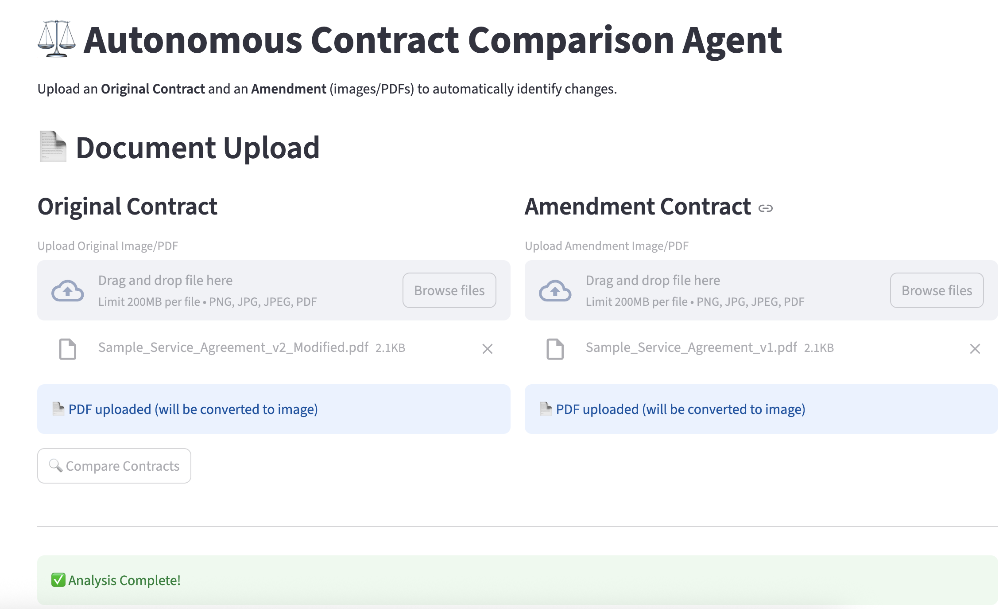

# Contract Comparison Agent

An AI-powered system that automatically compares contract documents (images or PDFs) and extracts changes using a collaborative two-agent architecture with GPT-4o Vision.



## Features

- **Multimodal Input**: Processes scanned images and PDFs
- **Two-Agent Architecture**: Specialized agents for contextualization and extraction
- **Structured Output**: Pydantic-validated JSON with sections changed, topics, and summaries
- **Guardrails**: Input validation, safety checks, and sensitive data detection
- **Quality Evaluation**: Multi-dimensional output quality assessment (5 metrics)
- **Web UI**: Streamlit interface with drag-and-drop upload
- **Testing Notebook**: Comprehensive Jupyter notebook for testing and validation
- **Complete Tracing**: Langfuse integration for observability
- **Production Ready**: Comprehensive tests and error handling

## Quick Start

### Prerequisites

- Python 3.10+
- OpenAI API key with GPT-4o access
- Langfuse account (free tier available)

### Installation

```bash
# Clone repository
git clone <your-repo-url>
cd autonomous-contract-comparison-agents

# Create virtual environment
python3 -m venv venv
source venv/bin/activate  # On Windows: venv\Scripts\activate

# Install dependencies
pip install -r requirements.txt

# Configure environment
cp .env.example .env
# Edit .env and add your API keys
```

### Running the Application

**Web UI (Recommended):**

```bash
streamlit run src/app.py
```

Then open http://localhost:8501 and upload your contracts.

**Command Line (Basic):**

```bash
python src/main.py --original data/test_contracts/contract1_original.jpg --amendment data/test_contracts/contract1_amendment.jpg
```

**Command Line (Enhanced with Guardrails & Evaluation):**

```bash
python src/main_enhanced.py --original data/test_contracts/contract1_original.jpg --amendment data/test_contracts/contract1_amendment.jpg --output results.json
```

**Jupyter Notebook (Interactive Testing):**

```bash
jupyter notebook notebooks/test_contract_flow.ipynb
```

## How It Works

### Basic Workflow

```
Input (Images/PDFs)
    ↓
GPT-4o Vision (Parse documents)
    ↓
Agent 1 (Contextualization) → Maps structure and sections
    ↓
Agent 2 (Extraction) → Extracts specific changes
    ↓
Pydantic Validation
    ↓
Structured JSON Output
```

### Enhanced Workflow (with Guardrails & Evaluation)

```
Input (Images/PDFs)
    ↓
Guardrails (Input Validation & Safety)
    ↓
GPT-4o Vision (Parse documents)
    ↓
Agent 1 (Contextualization) → Maps structure and sections
    ↓
Agent 2 (Extraction) → Extracts specific changes
    ↓
Pydantic Validation
    ↓
Guardrails (Output Validation)
    ↓
Evaluator (Quality Assessment)
    ↓
Structured JSON Output + Metrics
```

## Output Format

```json
{
  "sections_changed": [
    "Section 2.1 - Payment Terms",
    "Section 4.3 - Confidentiality"
  ],
  "topics_touched": ["Payment Terms", "Confidentiality", "Service Levels"],
  "summary_of_the_change": "The amendment extends payment terms from 30 to 45 days..."
}
```

## Environment Variables

Required in `.env`:

```bash
OPENAI_API_KEY=your_key_here
LANGFUSE_PUBLIC_KEY=your_key_here
LANGFUSE_SECRET_KEY=your_key_here
LANGFUSE_HOST=https://cloud.langfuse.com  # Optional
```

## Testing

### Unit Tests

```bash
# Run all tests
pytest

# Run with coverage
pytest --cov=src tests/
```

### Interactive Testing (Jupyter Notebook)

```bash
# Start Jupyter
jupyter notebook

# Open and run notebooks/test_contract_flow.ipynb
```

The test notebook provides:

- Automated testing of all contracts in `data/test_contracts/`
- Guardrails validation results
- Quality evaluation with 5-dimension scoring
- Visual results with pandas DataFrames
- Exportable JSON results

## Project Structure

```
autonomous-contract-comparison-agents/
├── src/
│   ├── main.py                         # Main workflow orchestration
│   ├── main_enhanced.py                # Enhanced workflow with guardrails & evaluation
│   ├── app.py                          # Streamlit web UI
│   ├── image_parser.py                 # Image/PDF to text conversion
│   ├── models.py                       # Pydantic data models
│   ├── guardrails.py                   # Input/output validation and safety
│   ├── evaluator.py                    # Quality evaluation system
│   └── agents/
│       ├── contextualization_agent.py  # Agent 1
│       └── extraction_agent.py         # Agent 2
├── notebooks/
│   ├── test_contract_flow.ipynb        # Interactive testing notebook
│   └── outputs/                        # Test results (auto-generated)
├── tests/                              # Unit test suite
├── data/test_contracts/                # Sample contracts
└── requirements.txt                    # Dependencies
```

## Technical Decisions & Architecture

### Why Two Agents?

The system employs a **collaborative two-agent architecture** that mirrors how legal professionals analyze contract amendments in practice. This separation of concerns provides several critical advantages:

**Agent 1 (Contextualization)** first establishes a comprehensive understanding of both documents by analyzing their structure, identifying corresponding sections, and mapping relationships between the original and amendment. This contextual foundation is essential because contracts often undergo renumbering, reorganization, or structural changes that would confuse a single-pass analysis. By dedicating an entire agent to this contextualization phase, we ensure accurate section correspondence even when amendments significantly restructure the document.

**Agent 2 (Extraction)** then leverages this structural understanding to perform precise change extraction. With Agent 1's section mappings and identified change areas, Agent 2 can focus its analysis on the specific locations where modifications occurred, dramatically improving accuracy and reducing hallucinations. This targeted approach prevents the agent from being overwhelmed by comparing entire documents character-by-character.

This pattern also enables **better error handling and debugging**—if change detection fails, we can isolate whether the issue lies in structural analysis (Agent 1) or change extraction (Agent 2). Additionally, the handoff mechanism creates a natural checkpoint where we can validate that structural analysis succeeded before proceeding to extraction.

### Why GPT-4o Vision?

We selected **GPT-4o with vision capabilities** as the multimodal LLM for several technical reasons. First, it provides **native image understanding** without requiring separate OCR preprocessing, reducing error propagation from OCR failures. GPT-4o's 128K token context window accommodates typical 5-10 page contracts in a single API call, maintaining document coherence. Its vision API accepts base64-encoded images with high-detail processing, ensuring accurate text extraction even from lower-quality scans. The model's instruction-following capabilities allow us to provide detailed extraction prompts that preserve document hierarchy (sections, subsections, clauses), which is critical for legal documents. Finally, GPT-4o's structured output mode with JSON formatting ensures reliable Pydantic validation, and OpenAI's API stability and comprehensive error handling make it production-ready for enterprise legal workflows.

## Langfuse Tracing & Observability

The entire workflow is instrumented with **Langfuse** to provide complete observability into the contract comparison process. Every major step—image parsing, agent execution, and validation—is traced with detailed metadata.

### Accessing Traces

After running the system, traces are automatically uploaded to your Langfuse dashboard:

1. **Via Command Line**: When you run `python src/main.py`, the system prints a trace ID and Langfuse dashboard URL at the end
2. **Via Web UI**: Click the "View Trace" popover after analysis completes to get a direct link to the trace
3. **Direct Access**: Visit [https://cloud.langfuse.com](https://cloud.langfuse.com) and navigate to your project

### What's Captured in Traces

Each trace includes a hierarchical view showing:

- **Parent Trace**: Complete workflow with session ID, input file paths, and total execution time
- **Child Spans**: Individual steps (parse original, parse amendment, Agent 1, Agent 2, validation)
- **Token Usage**: Prompt tokens, completion tokens, and total tokens for each LLM call
- **Latency**: Execution time for each step to identify bottlenecks
- **Input/Output**: The actual data passed between agents and returned by each step
- **Metadata**: Model names, agent identifiers, section counts, change area counts

This observability is critical for production deployment—it enables debugging failed extractions, monitoring API costs, optimizing prompt performance, and providing audit trails for legal compliance.

## Key Technologies

- **GPT-4o Vision**: Multimodal document parsing
- **Pydantic v2**: Data validation and structured outputs
- **Langfuse**: Tracing and observability
- **Streamlit**: Web interface
- **PyMuPDF**: PDF processing (no system dependencies)

## Troubleshooting

**"No module named 'src'"**

- Ensure you're running from the project root directory

**"Missing API key"**

- Check `.env` file has all required keys
- Verify keys are valid and have GPT-4o access

**PDF upload fails**

- Ensure PyMuPDF is installed: `pip install PyMuPDF`

## License

MIT License - See LICENSE file for details

## Contact

For questions or issues, please open a GitHub issue.
